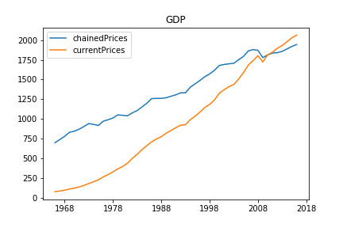

# A tiny script for accessing the API of Statistics Denmark

apiDST holds functions to do basic interaction with the API of Statistics Denmark. Beyond that the idea of this project is to build a self-updating page with graphs of key figures of the Danish economy and society.  


<center></center>
<!--  -->

## Usage
The script contains the class `DST()`, which takes arguments `language` and `form`, both of which have default values. To learn more about what values can be supplied here or as kwargs, check out [the API console](http://api.statbank.dk/console#subjects).


After importing the .py file, you can call the following command to get information about the various datasets, or simply check the website of [DST](statistikbanken.dk).

```python
DST().subject('01')     # runs from 01 to 18
DST().table(subjects = ['01','02'])
```
Datasets are stored with alphanumeric id's such as `FOLK1A`, to download these simply runs

```python
DST(lang = 'da').getData(id = 'FOLK1A')
```

To control which variables are produced `.getData()` takes a list, while a dictionary is used to define which levels/values of each variable is wanted. The call below returns population data from the dataset `FOLK1A`, with variables for time (`Tid`), gender (`KØN`), subsetted to only return females, and area (`OMRÅDE`) subsetted to only return individuals in the municipality of Brøndby.

```python
DST().getData(id = 'FOLK1A',
              vars = ['Tid', 'KØN', 'OMRÅDE'],
              values =  {'Tid': ['*'], 'KØN': ['2'], 'OMRÅDE':['153']} )
```

To figure out which data are available in a given dataset, simply call `DST().metadata(id)`, to get a rather complex JSON of variables and values of a given dataset. Finally the function `DST().toCSV(table = output_from_getData , name = intended_filename)` handles a small quirk of the returned CSV's (at least on windows machines) making it easy to save the returned values as .csv's. 
