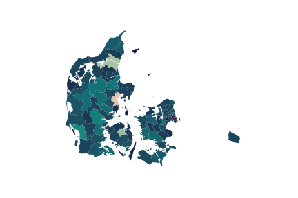

<link rel="stylesheet" href="tufte.css"/>

# Installation
To install PyDST simply clone [the repository](https://github.com/Kristianuruplarsen/PyDST), then open your terminal/command prompt
and use `cd` to navigate to the root folder of the repo (e.g. C:/Users/USER_NAME/Documents/github/PyDST on most windows machines).
while _in_ the root of the repo, run `pip install .` (or `python setup.py install`).

## Example usage
The module is intended to be easy and intuitive to use. After installing the package simply run
```python
import PyDST

conn = PyDST.connection(language = 'da')
```
to set up a basic connection session with the DST API. We can then use the session to get all sorts of information from DST. Lets begin by looking at all the tables under topic-id "02":

```python
res = conn.get_tables('02')

res.info
>>> Active	Description	First observation	ID	Last updated	Latest observation	Unit	Variables
>>> 0	True	Folketal den 1. i kvartalet	2008K1	FOLK1A	2018-05-08T08:00:00	2018K2	antal	[område, køn, alder, civilstand, tid]
>>> 1	True	Folketal den 1. i kvartalet	2008K1	FOLK1B	2018-05-08T08:00:00	2018K2	antal	[område, køn, alder, statsborgerskab, tid]
>>> 2	True	Folketal den 1. i kvartalet	2008K1	FOLK1C	2018-05-08T08:00:00	2018K2	antal	[område, køn, alder, herkomst, oprindelsesland...
>>> 3	True	Folketal den 1. i kvartalet	2008K1	FOLK1D	2018-05-08T08:00:00	2018K2	antal	[område, køn, alder, statsborgerskab, tid]
>>> 4	True	Folketal den 1. i kvartalet	2008K1	FOLK1E	2018-05-08T08:00:00	2018K2	antal	[område, køn, alder, herkomst, tid]
>>> ...
```

So clearly topic "02" is about population statistics. A next step might be to retrieve some data, from for example the "FOLK1A" table. First we will get some metadata on which variables are in the table

```python
meta = conn.get_metadata('FOLK1A')

meta.variables
>>> ['område', 'køn', 'alder', 'civilstand', 'tid']
```
Now to get the actual data, we will only get the variables `Tid` and `Område` (the actual count is also automatically delivered to us), and we only want observations from the second quarter of 2008 here. To carry out this request we run

```python
resp = conn.get_data('FOLK1A', variables = ['Tid', 'Område'], values = {'Tid': ['2008K2']})

data = resp.df
```

Finally lets use the municipality mapper to give a visual presentation of the danish population
```python
from PyDST import mapper
import cmocean

mapper.KOMplot(resp.df, cmap = cmocean.cm.curl, title = "")
```
(cmocean simply gives us nicer colors. To get it run `pip install cmocean` in your terminal). This gives us the following image:

<p align="center">

</p>

## Documentation
* [connecting to the API](connection)
* [mapping](map)


## Small notes for the curious
* Do not make your documentation in this way. It is a lot to maintain, and Sphinx can probably do it better. I'm only doing this because PyDST is a relatively simple, and i don't have time to learn Sphinx.
